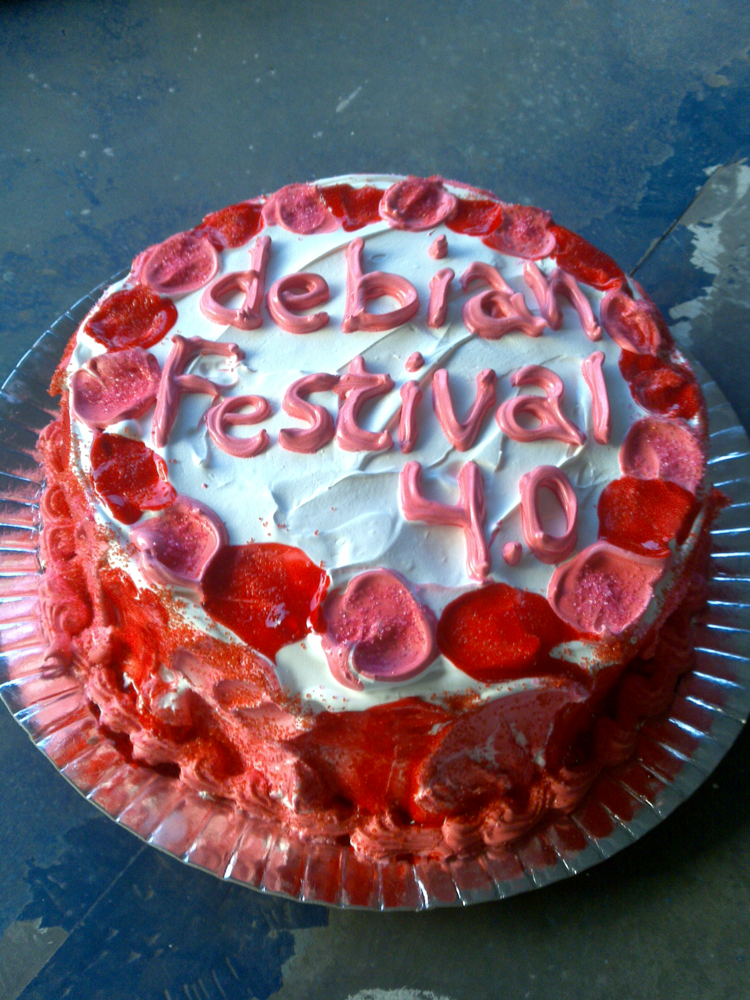

4 anos de Debian Festival
#########################
:date: 2009-08-20 16:51
:tags: debian, free software, linux, alagoas

Falando do evento que ajudei a criar e organizar em Maceió cuja quarta edição aconteceu essa semana:
O Debian Festival 4.0.

Tudo começou quando a PRIMEIRA caravana de Alagoas foi pro Encontro Nacional de Estudantes de Computação (`ENECOMP 2006`_).

Voltando do evento conversávamos sobre a falta de eventos em Maceió sobre Informática e TI no estado.

Com o aniversário do Debian próximo (`16 de agosto`_), resolvemos criar o PRIMEIRO evento pra comemorar isso e falar sobre Software Livre no estado.

.. figure:: images/df2.jpg
   :class: align-center
   :alt: Debian Festival 2 e o bolo com confeitos

   Debian Festival 2 e o bolo com confeitos

Apesar do pouco tempo de organização e da correria apareceram algumas figuras do Software Livre alagoano como o `Cárlisson`_,
que nos confirmaram o pioneirismo do evento.

Depois apareceram eventos destinados a Linux e SL.

Não escrevi isso dizendo que a mola propulsora desses eventos que apareceram foi o nosso.

Mas já dá pra ficar feliz em saber que ajudei a criar e **batizei** o evento, disseminando a cultura livre no estado, quando apenas existiam listas de emails esparsas e improdutivas.

.. figure:: images/df3.jpg
   :class: align-center
   :alt: O bolo bonitão do Debian Festival 3

   O bolo bonitão do Debian Festival 3

O evento aconteceu anualmente, sempre no meio de agosto e comemorando o aniversário do Debian com os bolos legais que ilustram o post!

Só queria agradecer aos que fizeram parte (como organização ou palestrantes) do
evento como o Vicente, Marco, Bruno, Mário, Williamson, Natália, Hélio,
Ellison, Wendell, Pretto, Felipe Wally, Cheops, Evellyn, Diogo Dutra e
galera de Arapiraca e aos que esqueci de mencionar.

Agradeço também aos que participaram e deram valor ao evento, discutiram, aprenderam e praticaram Software Livre.

   O bolo que eu não comi, mas tava com uma cara boa

O que fica dos eventos é realmente essa interação e as histórias da galera.
E mesmo com o "bolo" do pessoal estudante e profissional de computação às vezes, valeu tudo a pena.

.. figure:: images/df2_paris1.jpg
   :class: align-center
   :alt: Marco com a camisa da Paris Hilton (Debian Festival 2.0)

   Marco com a camisa da Paris Hilton (Debian Festival 2.0)

.. _ENECOMP 2006: http://wiki.enec.org.br/ENECOMP2006
.. _Marco: http://itsknowledgebaby.wordpress.com/
.. _16 de agosto: http://en.wikipedia.org/wiki/Debian
.. _Cárlisson: http://softwarelivre.org/bardo
.. _FREESON: http://freeson.com.br/
.. _Eliçu: http://twitter.com/ellisonleao
