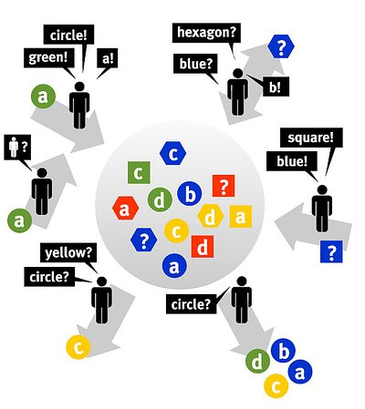

A fantástica fábrica de conhecimento
#####################################
:date: 2008-10-23 14:03
:tags: folksonomy, social tagging, tagging

É só pensar nas primeiras palavras que nos vêm a cabeça sobre o conteúdo de uma página Web e digitar numa caixinha e mandar pro `Digg`_, pro `Del.icio.us`_, pro `flickr`_.

Aí se organiza contéudo! Fácil né?!

Imagine um supermercado você pode colocar etiquetas em vinhos para classificá-los.

Você pode se valer da opinião "etiquetada" de outros consumidores para decidir que marca comprar.
Você pode enviesar sua opinião pela classificação de amigos e pessoas próximas.

Já que a classificação foi útil, você também rotula o vinho consumido, para beneficiar mais pessoas, como aconteceu com você.

Outra coisa, as pessoas que gostam de vinho frisante como você se identificarão através das etiquetas.
Uma comunidade pode surgir!

Isso é o que acontece nos `sistemas de Social Tagging <http://en.wikipedia.org/wiki/Social_bookmarking>`_.

Usando o conceito de atribuir tags (palavras-chave) a recursos da Web como fotos, artigos e páginas favoritadas, eles surgiram no meio do boom da Web 2.0.

   Definição gráfica de folksonomias

Com vários apreciadores classificando vinho, podemos então separar os tintos dos brancos, e criar várias outras categorizações.

Na Web, isso significa facilitar a navegação, recuperação, descoberta e organização de conteúdo (ou conhecimento!).

É dessa interação de apreciadores de vinho classificando produtos que surgem as folksonomias, termo oriundo da junção das palavras folk (pessoas) e taxonomia - estrutura de classificação hierárquica formal.

Um exemplo disso é estrutura de nuvem de tags - tem uma aqui do lado direito.

Porém, os sommeliers podem usar classificações que só valem para organização própria, com rótulos como “comprar”.
São as chamadas `tags egoístas <http://bierdoctor.net/papers/Rader_CSCW_Abstract_Final.pdf>`_.

Além disso, as folksonomias estão bem longe de taxonomias, pois a classificação é “flat”.

Isso significa que não existem relações entre os conceitos (tags) usados de modo a criar hierarquias, tudo está no mesmo nível.
Não se pode dizer que "tinto suave" é uma sub-categoria de "tinto".

**Saiba mais**:

* `Sobre o surgimento e definição do termo, pelo criador`_

*  `Folksonomia e a maneira com que nós colocamos ordem nas coisas`_

.. _Digg: http://digg.com/
.. _Del.icio.us: http://delicious.com/
.. _flickr: http://www.flickr.com/
.. _Sobre o surgimento e definição do termo, pelo criador: http://www.vanderwal.net/folksonomy.html
.. _Folksonomia e a maneira com que nós colocamos ordem nas coisas: http://revolucao.etc.br/archives/folksonomia-e-a-maneira-com-que-nos-colocamos-ordem-nas-coisas/
.. _`Tags e folksonomia: o usuário classifica a informação`: http://webinsider.uol.com.br/index.php/2007/01/12/tags-e-folksonomia-as-pessoas-organizam-a-informacao/
