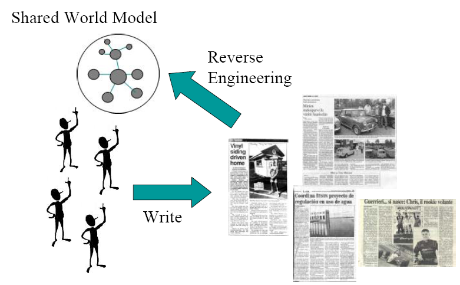

Aprendizagem de Ontologias
##########################
:date: 2008-10-31 02:38
:author: Icaro Medeiros
:tags: machine learning, ontology learning, semantic web, linked data, information retrieval
:slug: aprendizagem-de-ontologias

Vai aí um seminário que apresentei mês passado aqui no `mestrado`_, é uma apresentação sobre Ontology Learning.
Aprendizagem de ontologias são um conjunto de processos e técnicas para:

*  Construir uma ontologia do zero ;
*  Enriquecer, adaptar ou popular ontologias já existentes.

.. raw:: html

    <iframe src="//www.slideshare.net/slideshow/embed_code/1158121" width="427" height="356" frameborder="0" marginwidth="0" marginheight="0" scrolling="no" style="border:1px solid #CCC; border-width:1px 1px 0; margin-bottom:5px; max-width: 100%;" allowfullscreen>
    </iframe>
    

        <strong>
            <a href="https://www.slideshare.net/icaromedeiros/slidesontolearning" title="Ontology Learning" target="_blank">Ontology Learning</a>
        </strong> from
        <strong>
            <a href="http://www.slideshare.net/icaromedeiros" target="_blank">Ícaro Medeiros</a>
        </strong>
    

Isso é feito de maneira semi-automática a partir de dados como texto (principalmente), schemas XML, bancos de dados e até folksonomias
sobre o domínio a ser formalizado.

   Aprendizagem de Ontologias == Reserve Engineering

#. Especialistas do domínio escrevem artigos, relatórios técnicos, livros, etc.
#. Isso tá lá em texto (é seu corpus).
#. Com a aprendizagem temos uma conceitualização do
   domínio numa ontologia (seja ela uma hierarquia simples ou uma
   ontologia com relacionamentos e axiomas).
#. As definições que estão na ontologia representam uma síntese da
   opinião consensual dos especialistas sobre aquele domínio. Os
   especialistas ou os usuários da aplicação usando a ontologia (que
   podem ser outros especialistas) podem melhorar a ontologia depois, e
   esse refinamento ajuda os próprios métodos de aprendizagem. Cria-se
   então uma linha de passe (ciclo) em (2,3,4) - não tá representado aí
   na figura. Depois de algumas rodadas, a ontologia pode ganhar um
   troféuzinho.

Isso pode ser visto como uma tarefa de áreas como Extração de Informação
e Mineração de Texto.
Outros nomes tratam do mesmo assunto com nomes diferentes como
(Extração \| Emergência \| Geração \| Aquisição \|
Descoberta \| População \| Enriquecimento) de ontologias, com algumas diferenças bem sutis.
Pra mim o nome mesmo é Aprendizagem de Ontologias (Ontology Learning).

Saiba mais: `Wikipedia, in English`_.
E mais: `Ferramenta e plug-in Protége OntoLT`_!

.. _mestrado: http://www.cin.ufpe.br/~in1099/082/
.. _Aprendizagem de Ontologias (A presentation about Ontology Learning by Ícaro Medeiros - semantic web 2.0 3.0 ontologies engineering paris hilton barak obama): http://www.slideshare.net/icaromedeiros/slidesontolearning
.. _Wikipedia, in English: http://en.wikipedia.org/wiki/Ontology_learning
.. _Ferramenta e plug-in Protége OntoLT: http://olp.dfki.de/OntoLT/OntoLT.htm
