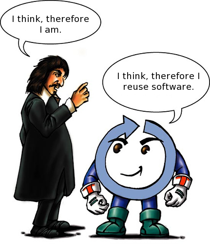

E se os filósofos fossem programadores?
#######################################
:date: 2009-04-21 17:46
:author: Icaro Medeiros
:tags: computer science, philosophy, programming languages, programming
:slug: e-se-os-filosofos-fossem-programadores

Traduzido e adaptado de `If philosophers were programmers`_ em 2009, revisado em 2014, quando do lançamento da versão nova do blog.

Num certo aspecto, o código reflete como o programador percebe o problema e sua solução, talvez simulando interações presentes no mundo real.
Antes de programar, os desenvolvedores gastam algum tempo pensando no problema, identificando propriedades importantes e suas conexões subjacentes.
Analogamente, filósofos estão constantemente tentando identificar as mais importantes propriedades de questões como `A Vida, O Universo e Tudo o Mais`_.

Assim podemos fazer um mapeamento entre as idéias de linguagens de
programação e as idéias que os filósofos tiveram ao longo dos séculos.
É perfeitamente razoável considerar linguagens de programação como
diferentes filosofias em um mundo virtual, onde entidades existem e
interajem entre si.
Até as perguntas fundamentais podem sofrer uma profunda transformação, por exemplo,
"O que é auto-consciência?" pode ser refraseada como "O que é `reflexão`_?".

Então e se os filosófos fossem programadores? Que linguagens eles usariam?

**Sócrates: O programador Assembly**

Sócrates foi um dos fundadores da filosofia mas não é aí que as
semelhanças acabam. Ele inventou um método para ganhar qualquer debate,
a dialética: Ele ficava fazendo perguntas até que seu adversário caísse
em contradição. Se alguém dizia que "moralidade é importante", ele
perguntava: "Como você define moralidade?".

   Sócrates

De modo similar, tudo em Assembly requer uma questão, não há nada
pré-assumido e tudo tem de ser sucinto para ter sentido. Se você é um
programador trabalhando com Sócrates e o envia algo como "var x = null",
seu parceiro vai começar perguntando "O que é var?".

**Aristóteles: O programador C influente**

Aristóteles teve um grande impacto na filosofia Ocidental, fundando
muitas áreas científicas, como Física, Biologia e até a nossa Lógica.
Ele examinou as entidades e a essência real de tudo, em constraste as
abstrações de Platão. Sua filosofia é orientada a uma "média dourada"
como a chave para contra-balançar tudo e alcançar moralidade ou entender
a vida.

   Hello Word!

A linguagem de programação C foi muito influente no projeto das
filosofias das linguagens, principalmente no nível sintático. Além
disso, quando surgiu, foi considerada uma "média dourada" entre as
linguagens de alto nível e a linguagem Assembly, combinando a
capacidade de escrever código independente de plataforma combinado com
o poder de acesso de baixo nível.

**Platão: O evangelizador do C++**

Platão é uma grande figura da Filosofia, estudante de Sócrates e
professor de Aristóteles. Então por que C++ vem depois de C? Platão é
famoso pelas referências a versões arquetípicas das coisas a nossa
volta. Então, uma xícara na sua mesa é uma sombra de um arquétipo
similar no mundo das idéias. Em programação, diremos que é uma instância
da classe Xícara.

Similarmente, C++, é uma extensão de C, e tenta capturar a idéia de
formas dando aos desenvolvedores a capacidade de abstrair o problema.
Mas por que Platão não programaria em Java? Ele opderia, mas ele não
estava tão certo que símbolos poderiam representar suas formas
perfeitamente, e analogamente, C++ continua sendo um superconjunto de C,
sendo compatível com a sintaxe de C.

**Estóicos: A comunidade feliz de Perl**

O estoicismo tem um impacto silencioso na cultura global e não há
ninguém diretamente por trás dessa escola de pensamento, ela foi
descrita por conquistas intelectuais colaborativas.

Os estóicos negam qualquer coisa imaterial e tenta explicar o mundo por
uma lógica. Eles rejeitam tudo que é ideal e se concentram na
moralidade, apreciando a liberdade da introspecção para alcançar a
verdadeira sabedoria. As pessoas devem ser irmãs, sem distinções e devem
contribuir para uma sociedade de amizade, paz e amor.

   Mensagem hippie usando expressões regulares!

O Perl é uma linguagem livre de forma. A frase mais comum no mundo Perl
é "existe mais de uma maneira de fazer isso. A filosofia por trás de
Perl rejeita restrições sintáticas, dando a liberdade aos programadores
de codificar ao seu estilo, mas ao mesmo tempo encoraja o
compartilhamento e a contribuição para a comunidade.

O poder de Perl se deve em grande parte a existência da CPAN, o arquivo
de módulos (bibliotecas) e software alegremente compartilhados por
programadores ao redor do mundo. A influência da linguagem do mundo da
programação tem sido silenciosa, podendo-se citar a influência para
linguagens de scripting, tipagem dinâmica e programação funcional.

**René Descartes: O verdadeiro guru Java**

O cerne da filosofia de Descartes  (que está no famoso livro "`Principia
Philosophiae`_\ ") é o conceito de cogito (ego intelectual). Ele
acreditava que a dúvida é a prova da existência, e o cogito é a causa da
dúvida, o que nos leva a famosa frase "cogito ergo sum" (I think
therefore I am). O cogito nada mais é do que outro processo que fazemos,
mas na verdade comanda tudo que nós fazemos.
Então, o que queremos, imaginamos ou sentimos é acessível apenas através dele.
O pensar seria um método da classe abstrata Thinker, talvez?

   Descartes extends Thinker

Descartes também é responsável por outra revolução no campo da
filosofia. A partir do seu trabalho, os filósofos passam a evitar
abstrações confusas e estabelecer uma forma sucinta, praticamente
geométrica, já que ele apresentava suas idéias na forma de teoremas.

Descartes seria um perfeito guru Java. Java é uma linguagem fortemente
tipada, na qual tudo deve ter um tipo (ou compartilhar uma forma) antes
de ser usada. Isso combina perfeitamente com os esforços de Descartes de
ser sempre exato sobre o que estava falando. O cogito é de fato uma nova
maneira de pensar as formas de Platão, com uma ligeira variação na qual
ideias existem porque nós pensamos sobre elas e não em outro universo. A
respeito disso, a filosofia é puramente orientada a objeto, dado que as
solução em que chegamos são produtos diretos dos nossos intelectos.

**Immanuel Kant: O primeiro programador Python**

Kant encontrou uma forma de combinar duas metodologias opositoras da
filosofia: o logicismo de Descartes e o empirismo quando disse: "Que tal
os dois?". Kant investigou como os humanos raciocinam, alegando que a
experiência oferece a verdade, mas uma verdade que já foi filtrada por
um julgamento intelectual lógico (a priori).

No final da vida ele examinou a estética, e a teoria tentando explicar a
maneira pela qual percebemos a beleza.
Kant foi uma personalidade extremamente concisa, sendo obcecado por exatidão e organização.
Similarmente, Python é uma linguagem que tenta combinar diferentes
soluções e promove uma nova. Como a linguagem aceita diferentes
paradgimas, de orientação a objeto a programação baseada em contratos.
Os programadores Python rejeitam o formato livre de linguagens como
Perl, e mesmo emprestando algumas características dela, eles enfatizam o
código simples e explícito.

Python se tornou tão "obcecado" por organização que impõe endentação de
código e delimitadores de blocos de código aos seus usuários. No "Zen de
Python", o primeiro dos 19 mandamentos é "O Belo é melhor que o feio". A
obsessão de Kant pela beleza e a estética faz dele o primeiro
programador Python.

O que dizer de outros filósofos e linguagens? O que vocês acham? Dizem
por aí que os sofistas (sic!) usam Visual Basic (sic!).

Traduzido de `If philosophers were programmers`_. Faltou um no final,
Wittgenstein e Haskell. Mas nenhum dos dois é muito conhecido, então
ficaram de fora, até porque o post já tava gigante. Abraços.

.. _A Vida, O Universo e Tudo o Mais: http://pt.wikipedia.org/wiki/Life,_the_Universe_and_Everything
.. _reflexão: http://en.wikipedia.org/wiki/Reflection_(computer_science)
.. _Principia Philosophiae: http://en.wikipedia.org/wiki/Principles_of_Philosophy
.. _If philosophers were programmers: http://developeronline.blogspot.com/2009/04/if-philosophers-were-programmers.html
