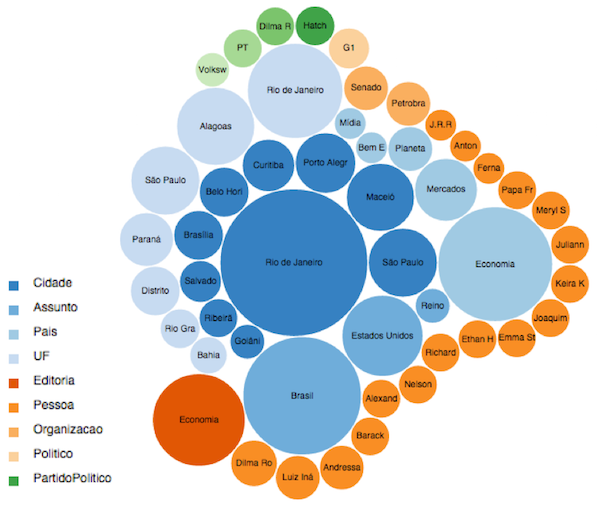

Linked Data, Big Data and User Science at globo.com
###################################################
:tags: talks, linked data, rdf, sparql, semantic web, big data, hadoop, kafka, user modeling, user science, user tracking, social media analytics
:slug:  linked-data-big-data-user-science-at-globo-com
:date: 2015-03-11

.. itemscope:: EducationEvent
    :tag: p

    This week in :itemprop:`Rio <location>` the first :itemprop:`Semantic Computing Meeting <name>` was held at :itemprop:`IGEO (Federal University of Rio de Janeiro) <address>`.
    I was pleased to present a talk about the work we do at Globo.com regarding Linked Data, Big Data and User Science.

This `meeting <http://compsem.github.io>`_ gathered many researchers and industry practicioneers on Semantic Web, Natural Language Processing, Machine Learning, Big Data, Information Retrieval, and related areas.

Throughout the day it was possible to get some insights about trending topics on these areas,
from researchers with great academic background such as `Daniel Schwabe <http://www.inf.puc-rio.br/~schwabe>`_
(professor at `PUC-Rio <http://www.inf.puc-rio.br>`_)
to leading industry researchers like `Karin Breitman <https://br.linkedin.com/pub/karin-breitman/0/697/602>`_
(formerly a professor at PUC-Rio and now chief scientist at `EMC Research Brazil <http://www.emc.com/brazilresearch>`_).

Moreover, IBM research Brazil was also represented by researchers `Cícero dos Santos <http://researcher.watson.ibm.com/researcher/view.php?person=br-cicerons>_` and `Alexandre Rademaker <http://researcher.watson.ibm.com/researcher/view.php?person=br-alexrad>`_.

After `Watson <http://www.ibm.com/smarterplanet/us/en/ibmwatson/>`_ development,
IBM is now intensively trying to create products with related technologies
in their new business area named as `Cognitive Computing <http://www.research.ibm.com/cognitive-computing/>`_.

It is interesting to see that we now have an active community for these technologies
and more and more events are starting to appear,
such a `Rio Big Data Meetup <http://www.meetup.com/Rio-Big-Data-Meetup/>`_.
Moreover, traditional software development conferences like
`QCon São Paulo <http://qconsp.com/track/big-data-aplica%C3%A7%C3%B5es-que-aprendem>`_
how have Big Data tracks.

About my talk
-------------

In my talk I walk through how Globo.com is interested in getting to know better content, interactions, and users.

The first axis (content) is well developed by ontologies,
a triplestore database `Virtuoso <http://virtuoso.openlinksw.com/>`_,
and a semantic annotation tool that is well documented
(there are lots of examples on my `slideshare account <http://slideshare.net/icaromedeiros>`_).

Now we are intensively working on understanding user interaction through a pipeline that starts on the user browser where we capture events and goes through `Kafka messaging service <http://kafka.apache.org/>`_ and, finally, to `Hbase persistence <http://hbase.apache.org/>`_.

This lead us to semantic user modeling that works by matching our semantic content classification
with user interaction.
Annotations from interacted content are then added to a user profile with a score representing
how relevant a specific entity (person, place, organization and so on) is to a user.

We use `spreading activation <http://en.wikipedia.org/wiki/Spreading_activation>`_,
a semantic network technique, to assign weights to entities in a user model.
It is a form of simple inference to capture related entities with the ones directly
annotated in content users interacted with, as depicted below.

.. figure:: images/spreading-activation.png
   :class: align-center
   :alt: Spreading Activation

   Spreading Activation

Some questions can then be answered by querying a user profile:

- What team does the user support?
- Where does the user lives?
- Which TV celebrity does the user likes most?

For example, this visualization shows my profile in product `G1 <http://g1.globo.com>`_,
where the circle size represent entity score and colors represent classes.

   My user profile at G1

Enjoy the slides and feel free to comment.

.. raw:: html

  <iframe src="//www.slideshare.net/slideshow/embed_code/39052354" width="476" height="400" frameborder="0" marginwidth="0" marginheight="0" scrolling="no"></iframe>

More about the meeting
----------------------

Refer to the `meeting website <http://compsem.github.io>`_ for presenter's contact information.

