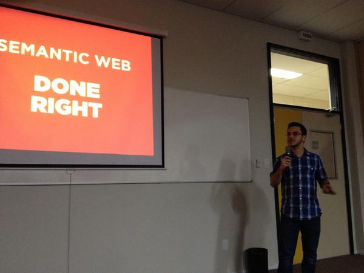
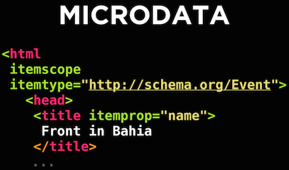
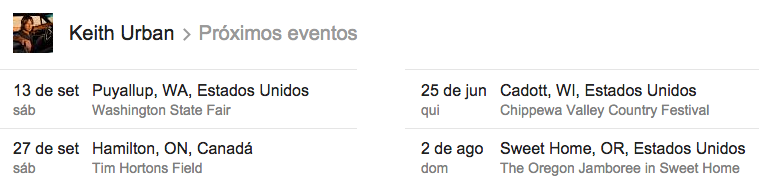

Linked data in use
##################
:tags: talks, linked data, rdf, sparql, semantic web, schema.org, json-ld, json, json schema
:slug: linked-data-in-use
:date: 2014-09-13

.. itemscope:: BusinessEvent
    :tag: p

    Today I have presented a talk in :itemprop:`Salvador <location>` at :itemprop:`Front in Bahia 2014 <name>`.

`Front in Bahia 2014 <www.frontinbahia.com.br>`_ is a conference from the well known **Front In** brand, specialized in front-end development.

   Linked Data in Use

In this talk I walk through Semantic Web initiatives, like RDF and SPARQL, linked data principles, discuss some implementation and adoption issues and talk about semantic annotation in HTML.

Semantic annotation using the `Schema.org <http://schema.org>`_ vocabulary is demonstrated using both HTML 5 Microdata or `JSON-LD <json-ld.org>`_ input.

   Schema.org example

There is a strong highlight in benefits seen in Google search results with Rich Snippets, Actions in Email, and Google Now with real examples like the example below.

   Rich snippets in Google SERP

Enjoy the slides here and feel free to comment.

.. raw:: html

  <iframe src="//www.slideshare.net/slideshow/embed_code/39052354" width="476" height="400" frameborder="0" marginwidth="0" marginheight="0" scrolling="no"></iframe>
