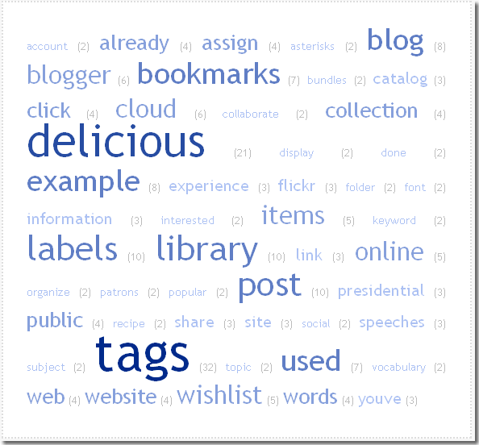

Master thesis
#############
:date: 2009-09-23 15:27
:tags: folksonomy, information retrieval, machine learning, social tagging, tag suggestion, tagging

Bom, o assunto da dissertação: `Folksonomias`_ e Sugestão de tags.

Construí um sistema que extraiu dados do Delicious e depois usei técnicas de Information Retrieval, Machine Learning e outras coisas para sugerir automaticamente tags para uma página Web.

Usei como base da sugestão de tags pra páginas Web o conteúdo textual, páginas vizinhas (inbound pages) e informação do WordNet e ontologias.

No final faço uma comparação entre as tags que sugeri e as tags do Delicious pra dar uma medida quantitativa do quanto o sistema é bom e uma análise do comportamento do usuário (p. ex. que tipo de tags o sistema não consegue sugerir: "semweb" e "webdev").

   Nuvem de tags

.. _Folksonomias: http://en.wikipedia.org/wiki/Folksonomy

O resultado disso pode ser visto nos slides abaixo:

.. raw:: html

    <iframe src="//www.slideshare.net/slideshow/embed_code/4865492" width="597" height="486" frameborder="0" marginwidth="0" marginheight="0" scrolling="no" style="border:1px solid #CCC; border-width:1px; margin-bottom:5px; max-width: 100%;" allowfullscreen> </iframe> 
 <strong> <a href="https://www.slideshare.net/icaromedeiros/tag-suggestion-using-mu" title="Tag Suggestion using Multiple Sources of Knowledge" target="_blank">Tag Suggestion using Multiple Sources of Knowledge</a> </strong> from <strong><a href="http://www.slideshare.net/icaromedeiros" target="_blank">Ícaro Medeiros</a></strong> 

