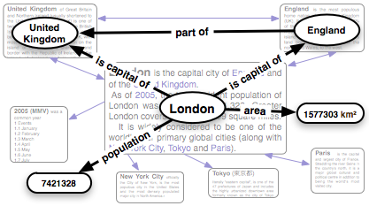

O jogo dos (meta)dados
######################
:date: 2008-11-05 21:30
:tags: folksonomy, metadata, semantic wikis, social tagging, wikis, tagging

Houve uma discussão sobre a burocracia da Web Semântica num post anterior.
Não precisa ser tão burocrático!

Só assim a Web pode ser semântica em escala.
Mas para garantir semântica precisamos de algumas estruturas (e ontologia é apenas uma delas, porém, a mais
completa, formal e bem estudada) para organizar os dados.

Duas formas de fazer isso que levam muito em consideração o que a Web 2.0 trouxe, sem precisar editar `OWL`_ e saber `Lógica de Descrição`_: folksonomias e Wikis Semânticos.

Wikis Semânticos são ambientes de edição Wiki onde atributos como relações entre páginas, suas categorias e hierarquias podem ser descritas "in a Wiki way", facinho como `editar um artigo da Wikipédia`_.
Uma grande feature de um Wiki Semântico são os links tipados.
É só colocar um rótulo no link, é só dizer o que este link significa.

Soa fácil né?
Pois é!
Veja aí a figura.
É do artigo sobre a `extensão semântica`_ do `MediaWiki`_ (software que a Wikipédia usa debaixo dos panos).

   Wikis Semânticos

Um usuário comum quer tarefas fáceis, produzir ontologias não é uma delas.
Assim, o conhecimento deles precisa ser capturado com interfaces analfabetas como caixinhas de texto para tags.
Até mesmo tipar links pode ser impeditivo.

E agora? Vamos precisar dos "engenheiros de conhecimento" da época dos sistemas especialistas para produzir todas as ontologias? Acho que não.

Com estruturas de semântica fraca como folksonomias temos dados capturados de qualquer tipo de usuário.
Podemos então usar técnicas de estatística, processamento de linguagem natural e análise de redes sociais para a inferência de conhecimento mais formal, que pode servir tanto pra melhorar a própria folksonomia ou para agregar serviços ao site que faz uso do sistema de social tagging.

Podemos fazer com que isso convirja para uma ontologia!

Além disso, metadados servem para fazer anotação semântica, ou seja, informação numa página que é processada por agentes com conhecimento de ontologias.

Por exemplo, usar `metadados dublin core`_ para especificar autor, título e outros dados pessoais numa página, de maneira formalizada, é um começo.

Finalmente... vamos usar estruturas com semântica formal bem definida como ontologias ou estruturas de semântica leve e depois extrair essas informações?

.. _OWL: http://www.eclipse.org/m2m/atl/usecases/ODMImplementation/img/MuseumOWL.PNG
.. _Lógica de Descrição: http://en.wikipedia.org/wiki/Description_logic
.. _já foram explicadas: http://Icaro Medeiros.wordpress.com/2008/10/23/a-fantastica-fabrica-de-conhecimento/
.. _editar um artigo da Wikipédia: http://pt.wikipedia.org/w/index.php?title=Web_sem%C3%A2ntica&action=edit
.. _extensão semântica: http://pt.wikipedia.org/wiki/Semantic_MediaWiki
.. _MediaWiki: http://pt.wikipedia.org/wiki/MediaWiki
.. _metadados dublin core: http://en.wikipedia.org/wiki/Dublin_Core
