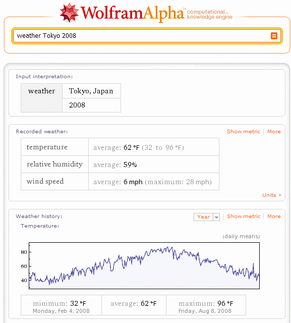

Wolfram Alpha - Você pergunta, a Web responde!?
###############################################
:date: 2009-05-06 23:35
:author: Icaro Medeiros
:tags: web search, google, knowledge reasoning, knowledge representation, wolfram, wolfram alpha
:slug: wolfram-alpha-voce-pergunta-a-web-responde

Depois dos fracassos de Cuil e Wikia, mais um Google Killer wannabe?
Acho que dessa vez não.
O hype sobre a ferramenta vem crescendo muito,
até porque ela vem com o respaldo de um cientista conhecido, Stephen
Wolfram, físico, matemático e empresário conhecido por ser autor da
ferramenta Mathematica e por trabalhos em áreas como autômatos
celulares.
Caros amigos, apresento-lhes o `Wolfram Alpha`_.
O jornal `The Independent diz que a ferramenta mudará a Internet pra sempre`_.
O sistema deve ser lançado ainda esse mês.

Segundo o autor, a ferramenta é uma "máquina de conhecimento
computacional". (...) . Hein?

Bom, diferente do Google, que retorna um bocado de links para possíveis
respostas às perguntas dos usuários, o Wolfram Alpha tenta entender a
pergunta e retornar uma resposta através de uma base de conhecimento
criada para as mais diversas áreas, contendo terabytes de informação
avaliada por especialistas e algoritmos para modelar e raciocinar sobre
esse conhecimento.

O sistema computa as respostas! Calcula! Não é um amontado de pares
pergunta-resposta nem busca respostas numa base de fatos. Ao invés disso
o sistema é capaz de entender e retornar respostas para alguns tipos de
pergunta. Além das respostas há maneiras de explorar conhecimento/dados
relacionados e efetuar comparações já que a resposta pode incluir
diagramas, gráficos e links para questões relacionadas.

Por exemplo, uma consulta sobre a temperatura em Tóquio no ano de 2008
mostrará médias de temperatura, umidade e velocidade do vento, além de
um gráfico com as temperaturas médias, mínimos e máximos ao longo do
ano. `Diferente do Google`_, que ia mandar você ver o site da agência de
meteorologia do Japão. No Wolfram Alpha é como perguntar a um expert na
área como naquela frase: "pergunte a quem realmente entende do assunto".

   Consulta sobre temperatura em Tóquio no ano de 2008

Como funciona? Além da interface de processamente de linguagem natural
para as perguntas, há um banco de dados com modelos formais de campos
como a Física, onde leis, propriedades de elementos e relacionamento
entre eles estão armazenados de maneira computável. O sistema é capaz de
resolver problemas de cálculo, séries e do genoma humano! Além de
ciência domínios como tecnologia, temperatura, negócios e música estão
incluídos.

Outra diferença em relação ao Google: O Wolfram Alpha pode responder
perguntas que ainda não foram feitas (e portanto não existem nos índices
de páginas Web) desde que os cálculos necessários para respondê-las
sejam conhecidos e estejam no seu modelo de mundo real.

Hoje em dia ferramentas como o Google funcionam semelhante a uma grande
tabuada de multiplicação, com referências a vários resultados de
produtos. Se o cálculo que vc quer saber está na tabuada, ele retorna.
Já o Wolfram Alpha tem o algoritmo e pode calcular essa resposta.

Um exemplo interessante é a consulta "O sobrinho do neto da tia do meu tio".
No Google não dá em nada, mas no Wolfram Alpha resulta numa árvore
genealógica e em informações como a relação de sangue (1/128).

.. figure:: images/microformats-logo.png
   :class: align-center
   :alt: O sobrinho do neto da tia do meu tio

   O sobrinho do neto da tia do meu tio

Outras características: por enquanto isso só será disponível em inglês,
haverá uma referência às fontes consultadas para as respostas, quando
houver controvérsia na resposta isso será declarado e o sistema também
mostrará resultados de sistemas como Google, Wikipédia e Yahoo.

Algumas questões no ar: Quão extensível é isso? Será difícil adicionar e
manter o conhecimento? Haverão erros? Quão frequentes serão esses erros?
Que formas de conhecimento o sistema poderá manipular no futuro?

Bom, eu tô pagando pra ver! Já me inscrevi pra receber notícias de
lançamento e pra testar a ferramenta antes disso, ainda sem resposta.
Vamos ver o que as próximas semanas aguardam e quando o sistema for
lançado eu posto de novo com minhas impressões e o que sair de notícia a
respeito.

Finalmente, destronar o Google é ilusão, até porque esse serviço será
uma coisa adicional e paralela a ele que não acaba com a nossa
necessidade de usá-lo. Você não vai usar o Wolfram Alpha para ver posts
de blog sobre um assunto ou escolher onde passar férias.

Assim, acho que no máximo esse sistema poderá ganhar a mesma importância
do atual oráculo da Web. Mas acho que para algumas áreas como a academia
essa base deles será um grande revolução, desde que o sistema
corresponda as expectativas.

E se o fizer, como falaram `nesse post`_, o sistema provavelmente será
adquirido pelo próprio Google ou por alguma empresa (Microsoft?)
querendo acabar com o Google. Só podiam mudar esse nome né? Muito
extenso e feio, diferente de coisas pegajosas como Google e Yahoo!

Termino o post com uma declaração romântica de Stephen Wolfram sobre o
sistema:

“What we’re trying to do is take all the things that can be computed
about the world…and try and package it to the point where we can just
walk up to a web site and have it deliver the knowledge we’d like to
have. Like interacting with an expert it will understand what you are
talking about, do the computation and present to you results.”

Mais informações:

Trecho de uma apresentação do sistema na Harvard:

[youtube=http://www.youtube.com/watch?v=hYhLsQPHNas]

Ótimo e completo artigo do Nova Spivack no Twine: `Wolfram Alpha is
Coming -- and It Could be as Important as Google`_

| `Mais screenshots do Wolfram Alpha`_
|  `Our First Impressions (ReadWriteWeb)`_
|  `A new paradigm for using computers and the web (ZDNET)`_
|  `Brilliant tool, Google killer, or lots of hype? (ZDNET)`_
|  `Nova ferramenta que promete desbancar Google (Google Discovery)`_
|  `Wolfram, Google killer?`_

.. _Wolfram Alpha: http://www.wolframalpha.com/
.. _The Independent diz que a ferramenta mudará a Internet pra sempre: http://www.independent.co.uk/life-style/gadgets-and-tech/news/an-invention-that-could-change-the-internet-for-ever-1678109.html
.. _Diferente do Google: http://www.google.pt/search?q=weather+tokyo+2008
.. _nesse post: http://blogs.zdnet.com/BTL/?p=14108
.. _Wolfram Alpha is Coming -- and It Could be as Important as Google: http://www.twine.com/item/122mz8lz9-4c/wolfram-alpha-is-coming-and-it-could-be-as-important-as-google
.. _Mais screenshots do Wolfram Alpha: http://news.cnet.com/2300-17939_3-10000825-1.html?tag=mncol
.. _Our First Impressions (ReadWriteWeb): http://www.readwriteweb.com/archives/wolframalpha_our_first_impressions.php
.. _A new paradigm for using computers and the web (ZDNET): http://blogs.zdnet.com/BTL/?p=14108
.. _Brilliant tool, Google killer, or lots of hype? (ZDNET): http://education.zdnet.com/?p=2231&tag=rbxccnbzd1
.. _Nova ferramenta que promete desbancar Google (Google Discovery): http://googlediscovery.com/2009/03/09/wolfram-alpha-nova-ferramenta-que-promete-desbancar-google/
.. _Wolfram, Google killer?: http://updateordie.com/updates/tecnologia/2009/05/wolfram-google-killer/
